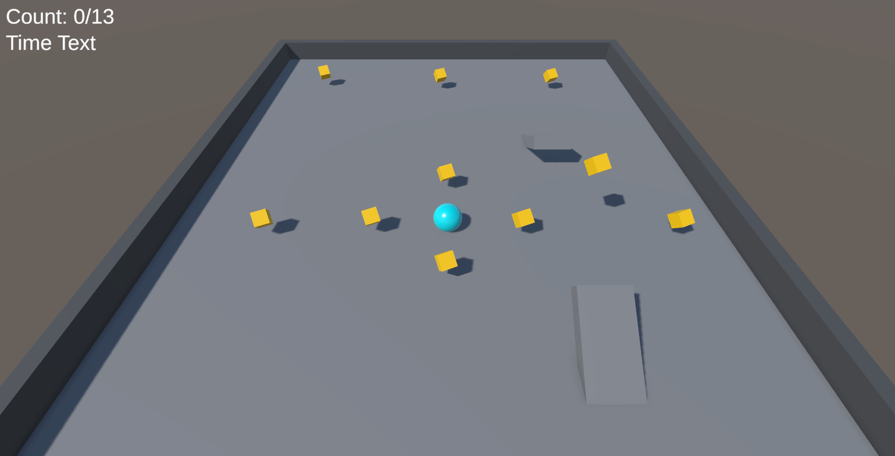

# Roll a ball

- [Information](#infromation)
- [How to run](#how-to-run)
  - [Download](#download)
  - [Run in unity](#run-in-unity)

## Infromation

In this project we follow a [Unity course](https://learn.unity.com/project/roll-a-ball?uv=2022.3) to create a basic game. The objective of the game is to collect objects in the shortes amount of time. An example of the game can be found and played at [itch.io](https://danielneset.itch.io/roll-a-ball).

## How to run

You need to have installed the unity engine.

### Download

You can download or clone this project from Github. The root folder contains some docs, readme and the folder with the game inside.

### Run in unity

- Open unity hub
- Find and press the add button in "Projects"
- Find the 'Rollaball' folder and open it
- Done

